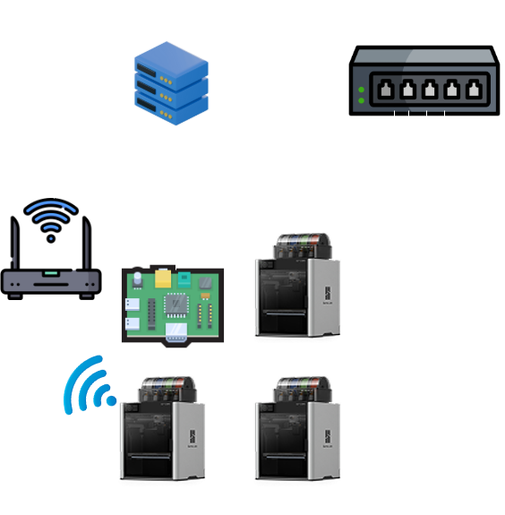
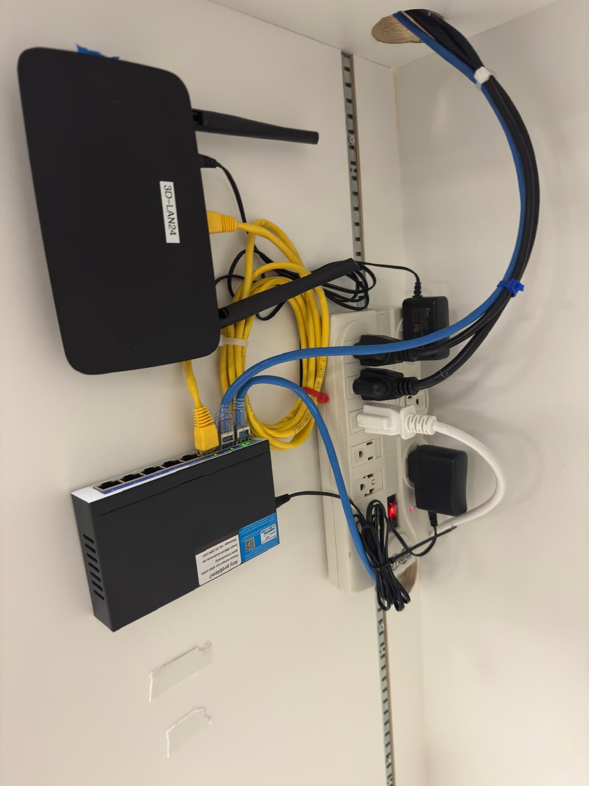

## Required Components & Tools

- Printers (using 4 for this example)
- PC (Anything that can run Linux) — *Dell OptiPlex 7050, Intel i3, 8GB RAM, 256GB SSD*
- [Network Switch](https://www.amazon.com/Gigabit-Managed-Ethernet-Splitter-Snooping/dp/B0D4TP93SH/ref=sr_1_5_sspa?sr=8-5-spons&sp_csd=d2lkZ2V0TmFtZT1zcF9udGY)
- [WiFi Router](https://www.amazon.com/WiFi-6-Router-Gigabit-Wireless/dp/B08H8ZLKKK/ref=sr_1_3?sr=8-3)
- Ethernet cables
- Zip ties

## OS

We'll be using [Linux Mint](https://www.linuxmint.com/) for this build. It's easy to use, beginner-friendly, and just works out of the box.

## Slicer Software

After setting up Linux Mint, you'll need a slicer. This guide uses [Bambu Studio](https://bambulab.com/en/download/studio), 
But any slicer with a network printing plugin will work (e.g., PrusaSlicer, OrcaSlicer, Cura).

> **Note:** Make sure your slicer of choice has network printing support enabled before proceeding.

## Network Setup

All printers connect to the network switch via Ethernet, with a single Ethernet cable running from 
the switch to the PC/Server.

