## Required Components & Tools

- Printers (using 4 for this example)
- PC (Anything that can run Linux) — *Dell OptiPlex 7050, Intel i3, 8GB RAM, 256GB SSD*
- [Network Switch](https://www.amazon.com/Gigabit-Managed-Ethernet-Splitter-Snooping/dp/B0D4TP93SH/ref=sr_1_5_sspa?sr=8-5-spons&sp_csd=d2lkZ2V0TmFtZT1zcF9udGY)
- [WiFi Router](https://www.amazon.com/WiFi-6-Router-Gigabit-Wireless/dp/B08H8ZLKKK/ref=sr_1_3?sr=8-3)
- Ethernet cables
- Zip ties

## OS

We'll be using [Linux Mint](https://www.linuxmint.com/) for this build. It's easy to use, beginner-friendly, and just works out of the box.

## Slicer Software

After setting up Linux Mint, you'll need a slicer. This guide uses [Bambu Studio](https://bambulab.com/en/download/studio), 
But any slicer with a network printing plugin will work (e.g., PrusaSlicer, OrcaSlicer, Cura).

> **Note:** Make sure your slicer of choice has network printing support enabled before proceeding.

## Network Setup

All printers connect to the network switch via Ethernet, with a single Ethernet cable running from 
the switch to the PC/Server.

  
  &nbsp;&nbsp;
  

## Printer Setup — LAN Only Mode

To keep all printers on the local network and off Bambu's cloud, we need to enable LAN Only Mode 
on each printer. Below we'll start with the **X1E**.

### Bambu X1E / H2D — LAN Only Mode

- In Settings, click Settings > LAN Only to enter the "LAN Only" page.

  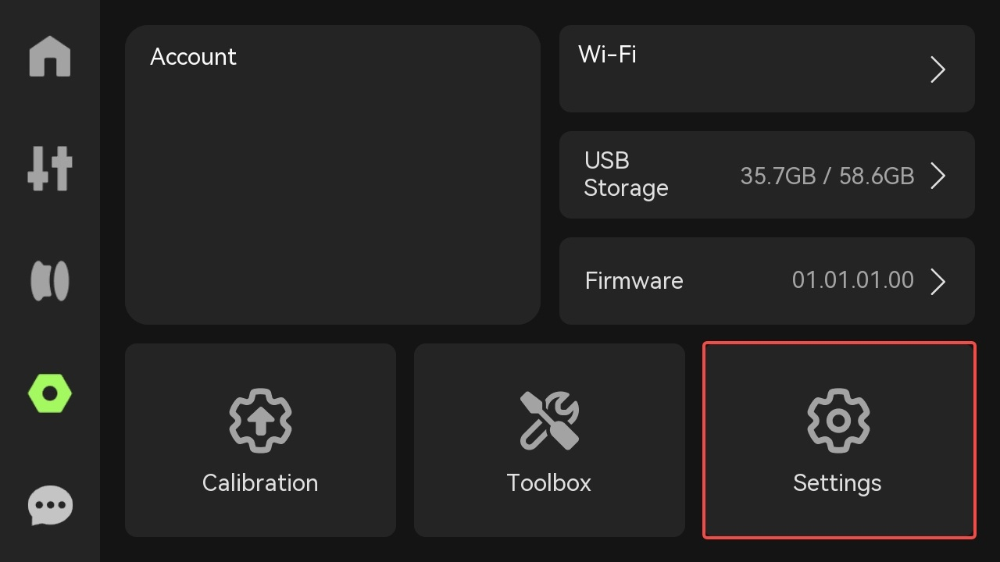

  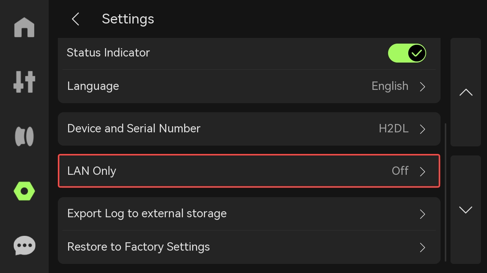

- Turn on LAN Only mode.

  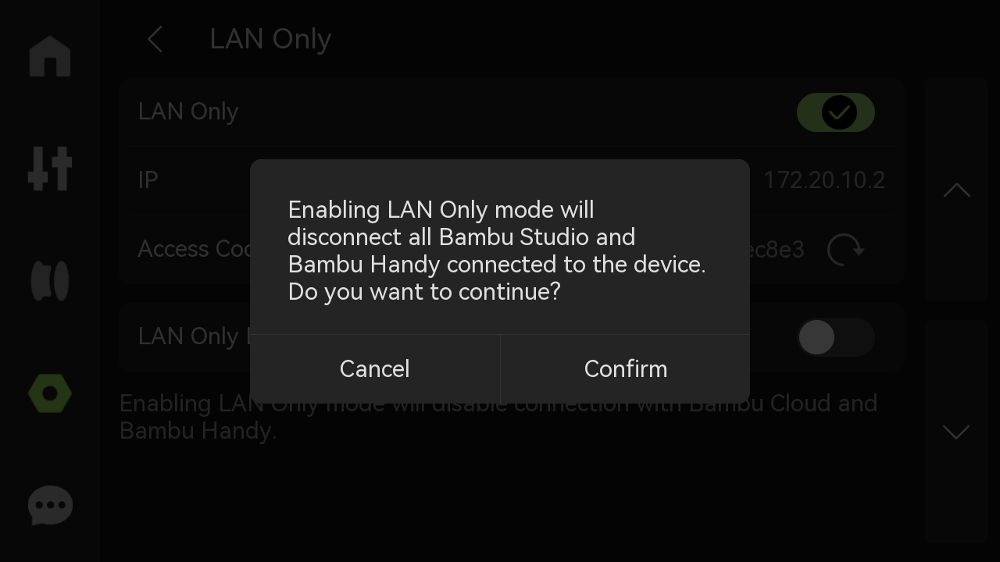

- Choose whether to enable LAN mode liveview according to your needs.

  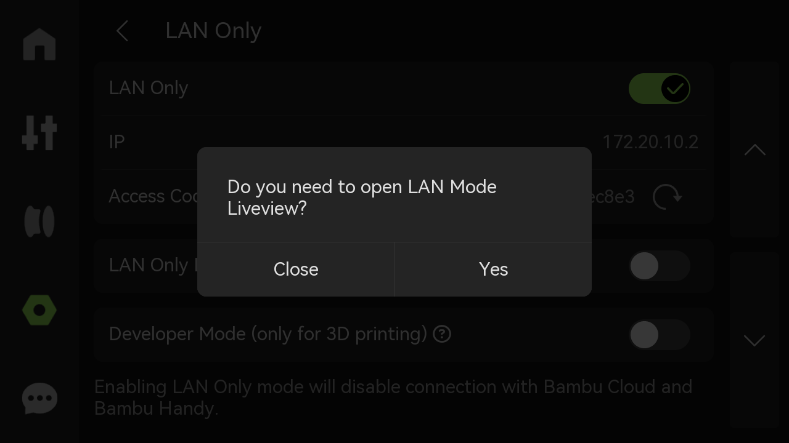

### Step 2: Bind the printer in LAN mode to Bambu Studio

- Open the printer list popup under the Device page and find the printer that has been switched to LAN-only mode. 
(The printer in LAN-only mode will have a lock icon in front of its name as shown in the image below)
This can take between 20 seconds to 60 seconds, or even longer in some rare cases. 
If your printer is still not displayed, please check if the Printer and Bambu Studio are on the same local network, and if communication is not blocked between them. (this can happen on some Guest networks)

  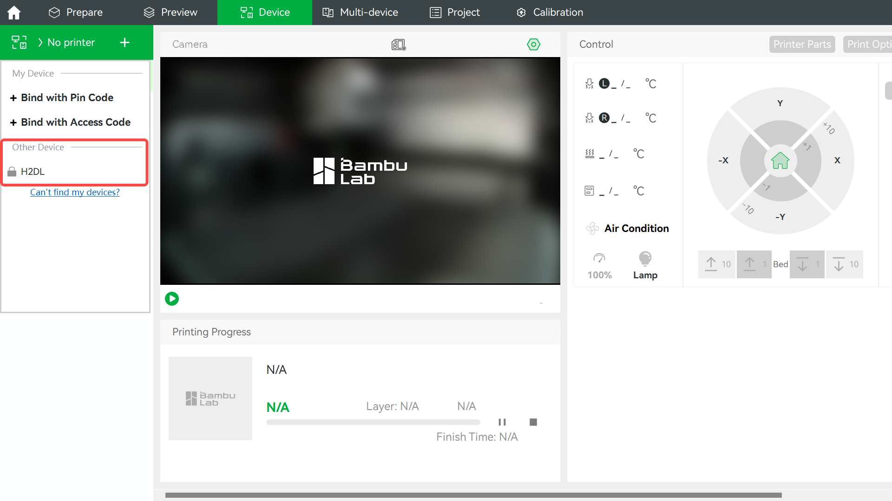

- Input the Printer Access Code and click "Confirm."

  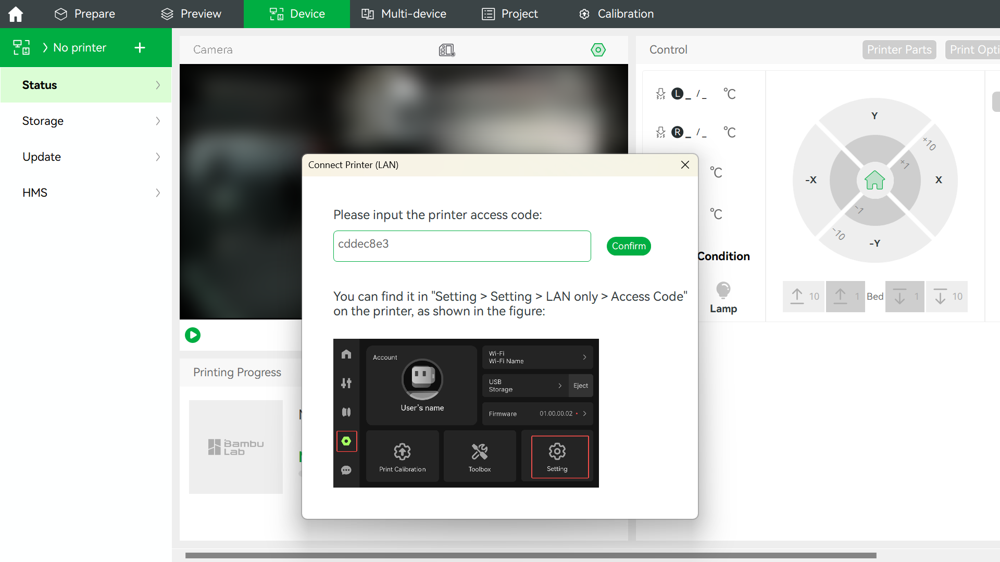

- After confirming the connection, you can use the printer in LAN mode.

  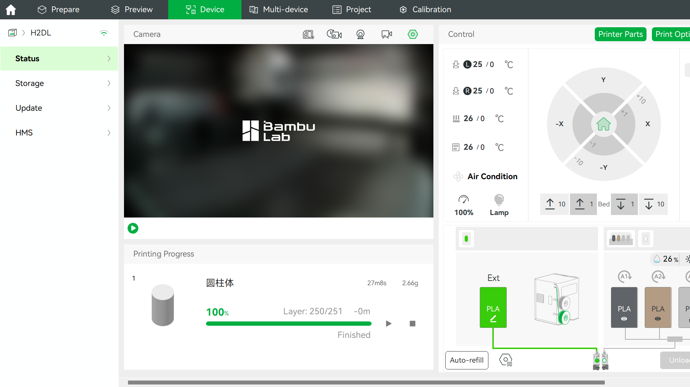

## Bambu P1P/P1S — LAN Only Mode

### Step 1: Enable LAN Only mode on the printer side.

- Navigate to Settings → WLAN and select it. Here, you can find the LAN Only Mode option.

  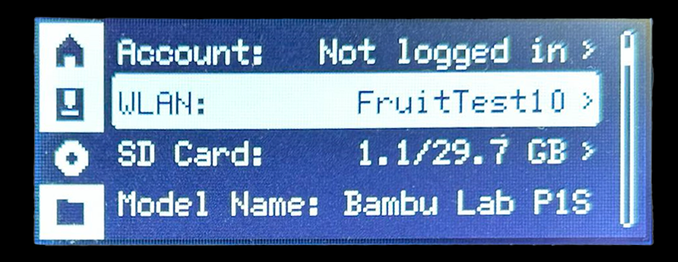

- The LAN Only Mode option is initially set to OFF. You can turn on this option here.

  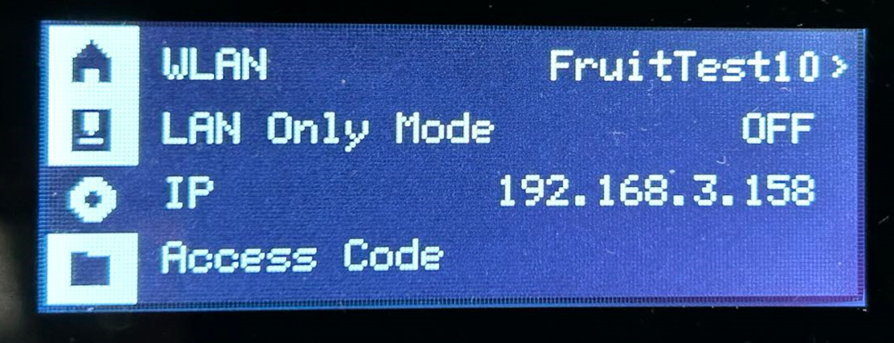

Confirm the selection by selecting "Yes"

  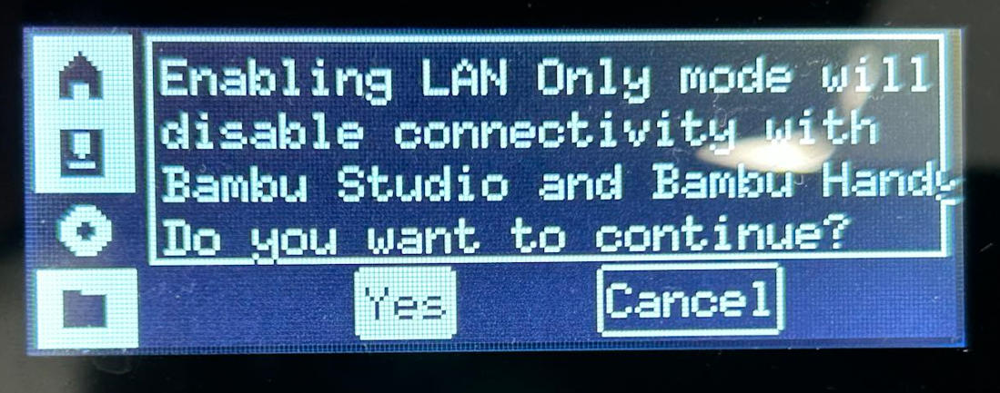

- When the LAN Only Mode option changes to "ON," it indicates that the switch has been successful. Take note of the Access Code.

  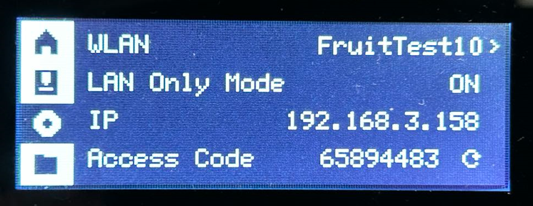

### Step 2: Bind the printer in LAN mode to Bambu Studio

- Open the printer list popup under the Device page and find the printer that has been switched to LAN-only mode. 
(The printer in LAN-only mode will have a lock icon in front of its name as shown in the image below)

- This can take between 20 seconds to 60 seconds, or even longer in some rare cases. 
If your printer is still not displayed, please check if the Printer and Bambu Studio are on the same local network, and if communication is not blocked between them. (this can happen on some Guest networks)

  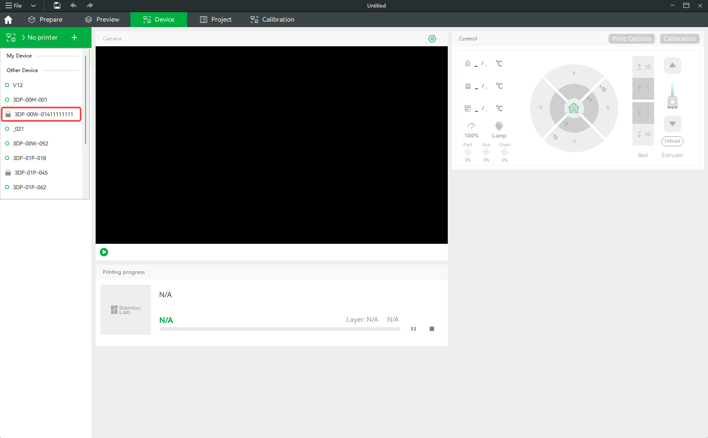

- Input the Printer Access Code and click "Confirm."  After the connection is confirmed, you can use the printer just like you normally would.

  

  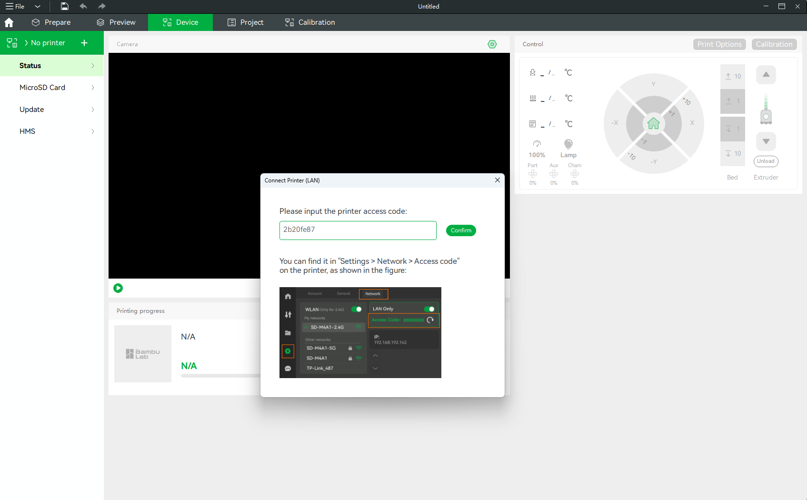

